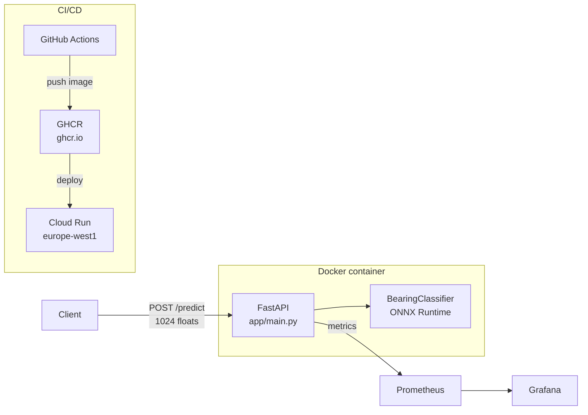
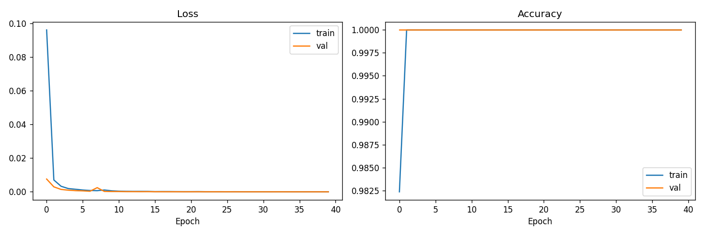
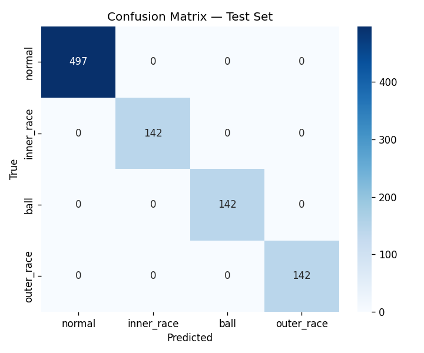

# PdM-Lite — Bearing Fault Detection Service

> A production-style predictive maintenance API that classifies rolling-element
> bearing faults from raw vibration signals.  
> Built on the CWRU dataset · 1D-CNN · FastAPI · ONNX Runtime · Google Cloud Run free tier.


---

## Architecture



---

## Dataset

**CWRU Bearing Dataset** — Drive-End accelerometer, 12 kHz sampling rate, fault diameter 0.007 in.

| Label | Class | Condition |
|-------|-------|-----------|
| 0 | `normal` | No fault |
| 1 | `inner_race` | Inner race fault |
| 2 | `ball` | Ball fault |
| 3 | `outer_race` | Outer race fault |

Four load conditions (0–3 HP) per class → 16 `.mat` files total.  
Each file is sliced into **1024-sample windows at 50% overlap**, then z-score normalised per window.  
Split: 70% train / 15% validation / 15% test (stratified).

---

## Model

**Architecture:** 3-block 1D-CNN with BatchNorm  
**Parameters:** ~50 k  
**Input:** `(batch, 1, 1024)` float32  
**Output:** `(batch, 4)` logits  

```
Input  (B, 1, 1024)
  Conv1d(1→32,  k=64, s=2) + BN + ReLU + MaxPool(2)  → (B, 32, 240)
  Conv1d(32→64, k=32, s=2) + BN + ReLU + MaxPool(2)  → (B, 64,  52)
  Conv1d(64→128,k=16, s=2) + BN + ReLU + AvgPool→1   → (B, 128,  1)
  Flatten → Linear(128, 4)                            → (B, 4)
```

Trained in Google Colab (T4 GPU) with Adam + ReduceLROnPlateau, early stopping (patience=6).  
Exported to ONNX opset 18 for CPU inference.

---

## Results

Test set: **923 windows** held out before training.

| Class | Precision | Recall | F1-score | Support |
|-------|-----------|--------|----------|---------|
| normal | 1.00 | 1.00 | 1.00 | 497 |
| inner_race | 1.00 | 1.00 | 1.00 | 142 |
| ball | 1.00 | 1.00 | 1.00 | 142 |
| outer_race | 1.00 | 1.00 | 1.00 | 142 |
| **overall** | **1.00** | **1.00** | **1.00** | **923** |

**Test accuracy: 100.00%**

| | |
|---|---|
|  |  |

> 100% accuracy is expected on CWRU — it is a clean, well-separated benchmark
> dataset. The value of this project is the end-to-end production pipeline, not
> the benchmark number itself.

---

## Local Setup

**Prerequisites:** Python 3.12+, Git

```bash
git clone https://github.com/Prennoy99/pdm-lite.git
cd pdm-lite
python3 -m venv venv
source venv/bin/activate
pip install -r requirements.txt
```

Run the API:

```bash
uvicorn app.main:app --reload
# → http://localhost:8000
```

Run the full stack (API + Prometheus + Grafana):

```bash
docker compose up --build
# API        → http://localhost:8000
# Prometheus → http://localhost:9090
# Grafana    → http://localhost:3000  (anonymous admin)
```

Run tests:

```bash
pytest tests/ -v
```

---

## API Reference

### `GET /health`

```bash
curl http://localhost:8000/health
```

```json
{"status": "ok"}
```

### `POST /predict`

Send 1024 consecutive vibration samples (float32).

```bash
curl -s -X POST http://localhost:8000/predict \
  -H "Content-Type: application/json" \
  -d "{\"signal\": [$(python3 -c "import random; print(','.join(str(random.gauss(0,1)) for _ in range(1024)))")]}" \
  | python3 -m json.tool
```

```json
{
  "predicted_class": "normal",
  "label": 0,
  "probabilities": {
    "normal": 0.9823,
    "inner_race": 0.0071,
    "ball": 0.0063,
    "outer_race": 0.0043
  },
  "inference_time_ms": 2.4
}
```

### `GET /metrics`

Prometheus metrics endpoint — scraped automatically by the monitoring stack.

Notable custom metric: `bearing_predictions_total{predicted_class="..."}` — cumulative count per fault class.

---

## Monitoring

Prometheus scrapes `/metrics` every 15 seconds. Open Grafana at `http://localhost:3000`, add a Prometheus data source pointing to `http://prometheus:9090`, then build dashboards for:

- `http_requests_total` — request rate by endpoint and status code
- `http_request_duration_seconds` — latency histogram
- `bearing_predictions_total` — prediction counts per fault class

---

## CI/CD

GitHub Actions pipeline (`.github/workflows/ci.yml`):

| Job | Steps |
|-----|-------|
| `test` | ruff lint → generate dummy model → pytest (14 tests) |
| `docker` | build image → push to GHCR (main branch only) |

Image is tagged `:latest` and `:<git-sha>` for reproducible deploys.

---

## Cloud Deployment

Deploy to Cloud Run (requires GCP project with billing enabled — Always Free tier applies):

```bash
export GCP_PROJECT_ID="your-gcp-project-id"
export GITHUB_USER="Prennoy99"
bash scripts/deploy.sh
```

Key settings: `--min-instances 0` (scale to zero) · `--max-instances 2` (cost guard) · `--memory 512Mi`

See `scripts/deploy.sh` for the full `gcloud run deploy` command.

---

## License

MIT
